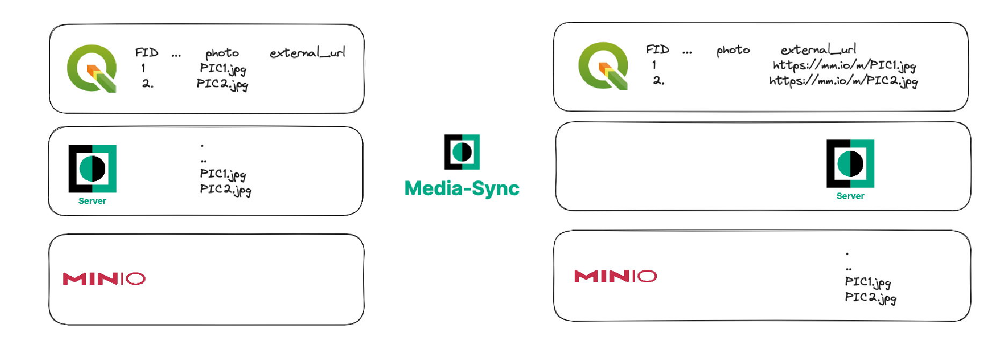

# Mergin Maps Media Sync
Sync media files from Mergin Maps projects to other storage backends. Currently, supported backends are MinIO (S3-like), Google Drive and local drive (mostly used for testing).

Sync works in two modes: in **COPY** mode media files are only copied to the external storage, in **MOVE** mode files are additionally removed from the Mergin Maps project (cloud). The user can choose whether references to media files in the project should be updated to point to the new location (e.g. S3 URL) or left unchanged.

**IMPORTANT**: The config file format was updated. There is now a single `config.yaml` file and project settings are defined in a `projects` list. Old single-project configs must be migrated (see the Config file structure section below).

### Quick start

Not sure where to start? Check out our [quick start](docs/quick_start.md) guide to set up sync from a new Mergin Maps project to your MinIO/S3 bucket.

<div><a href="https://merginmaps.com/community/join">Join our community chat</a><br/>and ask questions!</div><br />

Basic principle is that media-sync deamon COPY or MOVE your pictures from Mergin Maps server to other storage backend. Here is an example of MOVE operation:


### Config file structure

Multiple Mergin Maps projects can be configured in a single `config.yaml`. The Mergin user credentials and the storage driver are shared across all projects; each project specifies only its full project name, its own driver destination path and its reference table configuration.

For a quick start, copy `config.yaml.default` to `config.yaml` and edit it. The key sections are:

```yaml
project_working_dir: /tmp/mediasync   # base dir; each project gets its own sub-folder
allowed_extensions: [jpg, png]
operation_mode: copy                  # copy | move
driver: minio                         # local | minio | google_drive

mergin:
  url: https://app.merginmaps.com     # optional, defaults to public Mergin Maps instance
  username: myuser
  password: mypassword

# Driver connection settings – global, shared by all projects
minio:
  endpoint: localhost:9000
  access_key: ACCESS
  secret_key: SECRET
  bucket: mybucket
  secure: false
  region:
  public_url:        # optional: public base URL for DB links (e.g. https://cdn.example.com)

# Per-project settings
projects:
  - project_name: myworkspace/project1   # full Mergin project name
    bucket_subpath: project1             # minio: optional sub-path inside the bucket
    references:
      - file: survey.gpkg
        table: notes
        local_path_column: photo
        driver_path_column: ext_url

  - project_name: myworkspace/project2
    bucket_subpath: project2
    references: []

daemon:
   sleep_time: 10
```

Per-project path field per driver:

| Driver         | Field            | Description                               |
|----------------|------------------|-------------------------------------------|
| `local`        | `dest`           | Destination directory                     |
| `minio`        | `bucket_subpath` | Optional sub-path inside the bucket       |
| `google_drive` | `folder`         | Google Drive folder name                  |

#### MinIO: separate public URL for database links

By default, the URL stored in the reference table is constructed from `minio.endpoint` and `minio.bucket`.
If the public-facing domain differs from the upload endpoint (e.g. a CDN, reverse proxy, or load-balanced hostname),
set `minio.public_url` to the desired base URL:

```yaml
minio:
  endpoint: internal-minio.corp:9000   # used for file uploads
  bucket: media
  public_url: https://cdn.example.com  # used for URLs stored in the database
```

The stored link will then be `https://cdn.example.com/<object_path>` instead of
`http://internal-minio.corp:9000/media/<object_path>`.
`bucket_subpath` is still applied on top of `public_url` when set.

#### Running with Docker

Prepare a `config.yaml` (use `config.yaml.default` as a template) and mount it into the container:

```shell
docker run -it \
  --name mergin-media-sync \
  -v ${PWD}:/settings \
  lutraconsulting/mergin-media-sync /settings/config.yaml
```

#### Using Google Drive backend
For setup instructions and more details, please refer to our [Google Drive guide](./docs/google-drive-setup.md).

### Installation

#### Docker
The easiest way to run Media sync is with Docker provided on our [docker hub repo](https://hub.docker.com/repository/docker/lutraconsulting/mergin-media-sync). You can build your own local docker image, by first cloning the repo:

```
git clone git@github.com:lutraconsulting/mergin-media-sync.git
```

And then building the image:

```
docker build -t mergin_media_sync .
```

#### Manual installation

If you would like to avoid the manual installation steps, please follow the guide on using sync with Docker above. We use pipenv for managing python virtual environment.
```shell
pipenv install --three
```

If you get `ModuleNotFoundError: No module named 'skbuild'` error, try to update pip with command
`python -m pip install --upgrade pip`

### How to use

If you want to modify references to media files in some geopackage in your project, please make sure you have two columns there,
one with reference to local file and another for external URL where file can be downloaded from.
Initialization:

1. Set up configuration in config.yaml (see config.yaml.default for a sample).
2. All settings can be overridden with env variables.
3. Run media-sync.

```shell
pipenv run python3 media_sync.py
```

### Running Tests

You need to install also dev packages:
```shell
pipenv install --three --dev
```

and run local minio server:
```shell
docker run \
  -p 9000:9000 \
  -p 9001:9001 \
  --name minio\
  -e "MINIO_ROOT_USER=EXAMPLE" \
  -e "MINIO_ROOT_PASSWORD=EXAMPLEKEY" \
  quay.io/minio/minio server /data --console-address ":9001"
```

To run automatic tests:
```shell
  export TEST_MERGIN_URL=<url>                # testing server
  export TEST_API_USERNAME=<username>
  export TEST_API_PASSWORD=<pwd>
  export TEST_API_WORKSPACE=<workspace>
  export TEST_MINIO_URL="localhost:9000"
  export TEST_MINIO_ACCESS_KEY=EXAMPLE
  export TEST_MINIO_SECRET_KEY=EXAMPLEKEY
  pipenv run pytest test/
```

### Releasing new version

1. Update `version.py` and `CHANGELOG.md`
2. Tag the new version in git repo
3. Build and upload the new container (both with the new version tag and as the latest tag)
   ```
   docker build --no-cache -t lutraconsulting/mergin-media-sync .
   docker tag lutraconsulting/mergin-media-sync lutraconsulting/mergin-media-sync:0.1.0
   docker push lutraconsulting/mergin-media-sync:0.1.0
   docker push lutraconsulting/mergin-media-sync:latest
   ```
