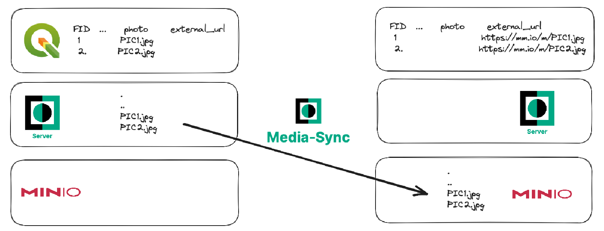

# Mergin Maps Media Sync
Sync media files from Mergin Maps projects to other storage backends. Currently, supported backend are MinIO (S3-like) backend, Google Drive and local drive (mostly used for testing).

Sync works in two modes, in COPY mode, where media files are only copied to external drive and MOVE mode, where files are
subsequently removed from Mergin Maps project (on cloud).

Also user can choose whether references to media files should be updated.

**IMPORTANT**: structure of the config file was changed in the latest version. Therefore old .ini config files should be migrated and enviromnent values should be updated.

### Quick start

Not sure where to start? Check out our [quick start](docs/quick_start.md) guide to set up sync from a new Mergin Maps project to your MinIO/S3 bucket.

<div><a href="https://merginmaps.com/community/join">Join our community chat</a><br/>and ask questions!</div><br />

Basic principle is that media-sync deamon COPY or MOVE your pictures from Mergin Maps server to other storage backend. Here is an example of MOVE operation:


#### Running with Docker
To run the container, use a command like the following one:
```shell
  docker run -it \
  -e MERGIN__USERNAME=john \
  -e MERGIN__PASSWORD=myStrongPassword \
  -e MERGIN__PROJECT_NAME=john/my_project \
  lutraconsulting/mergin-media-sync python3 media_sync_daemon.py
```
The sync process will start, regularly checking Mergin Maps service copy/move media files from a Mergin Maps project to an external storage.
Local drive is a default backend, you need to mount volume from host machine for data to persist.

#### Update reference table in geopackage
If you'd like to update references to media files (probably useful with MOVE mode), you can run:
```shell
docker run -it \
  -v /tmp/mediasync:/data \
  --name mergin-media-sync \
  -e MERGIN__USERNAME=john \
  -e MERGIN__PASSWORD=myStrongPassword \
  -e MERGIN__PROJECT_NAME=john/my_project \
  -e LOCAL__DEST=/data \
  -e OPERATION_MODE=move \
  -e REFERENCES = "[{file='my_survey.gpkg', table='my_table', local_path_column='col_with_path', driver_path_column='col_with_ext_url'}]" \
  lutraconsulting/mergin-media-sync python3 media_sync_daemon.py
```
Make sure you have correct structure of you .gpkg file. Otherwise leave all `REFERENCE__` variables empty.

#### Using MinIO backend
Last, in case you want to switch to different driver, you can run:
```shell
docker run -it \
  --name mergin-media-sync \
  -e MERGIN__USERNAME=john \
  -e MERGIN__PASSWORD=myStrongPassword \
  -e MERGIN__PROJECT_NAME=john/my_project \
  -e MERGIN__PROJECT_NAME=ttest/mediasync_test \
  -e DRIVER=minio \
  -e MINIO__ENDPOINT="minio-server-url" \
  -e MINIO__ACCESS_KEY=access-key \
  -e MINIO__SECRET_KEY=secret-key \
  -e MINIO__BUCKET=destination-bucket \
  -e MINIO__SECURE=1 \
  -e MINIO__BUCKET_SUBPATH=SubFolder \
  lutraconsulting/mergin-media-sync python3 media_sync_daemon.py
```

**Please note double underscore `__` is used to separate [config](config.yaml.default) group and item.**

The specification of `MINIO__BUCKET_SUBPATH` is optional and can be skipped if the files should be stored directly in `MINIO__BUCKET`.

### Installation

#### Docker
The easiest way to run Media sync is with Docker provided on our [docker hub repo](https://hub.docker.com/repository/docker/lutraconsulting/mergin-media-sync). You can build your own local docker image, by first cloning the repo:

```
git clone git@github.com:lutraconsulting/mergin-media-sync.git
```

And then building the image:

```
docker build -t mergin_media_sync .
```
#### Manual installation

If you would like to avoid the manual installation steps, please follow the guide on using sync with Docker above. We use pipenv for managing python virtual environment.

```shell
  pipenv install --three
```

If you get `ModuleNotFoundError: No module named 'skbuild'` error, try to update pip with command
`python -m pip install --upgrade pip`


### How to use

If you want to modify references to media files in some geopackage in your project, please make sure you have two columns there,
one with reference to local file and another for external URL where file can be downloaded from.

Initialization:

1. set up configuration in config.yaml  (see config.yaml.default for a sample)
2. all settings can be overridden with env variables (see docker example above)
3. run media-sync
```shell
  pipenv run python3 media_sync.py
```

### Running Tests
You need to install also dev packages:
```shell
  pipenv install --three --dev
```

and run local minio server:
```shell
docker run \
  -p 9000:9000 \
  -p 9001:9001 \
  --name minio\
  -e "MINIO_ROOT_USER=EXAMPLE" \
  -e "MINIO_ROOT_PASSWORD=EXAMPLEKEY" \
  quay.io/minio/minio server /data --console-address ":9001"
```

To run automatic tests:
```shell
  export TEST_MERGIN_URL=<url>                # testing server
  export TEST_API_USERNAME=<username>
  export TEST_API_PASSWORD=<pwd>
  export TEST_MINIO_URL="localhost:9000"
  export TEST_MINIO_ACCESS_KEY=EXAMPLE
  export TEST_MINIO_SECRET_KEY=EXAMPLEKEY
  pipenv run pytest test/
```

### Releasing new version

1. Update `version.py` and `CHANGELOG.md`
2. Tag the new version in git repo
3. Build and upload the new container (both with the new version tag and as the latest tag)
   ```
   docker build --no-cache -t lutraconsulting/mergin-media-sync .
   docker tag lutraconsulting/mergin-media-sync lutraconsulting/mergin-media-sync:0.1.0
   docker push lutraconsulting/mergin-media-sync:0.1.0
   docker push lutraconsulting/mergin-media-sync:latest
