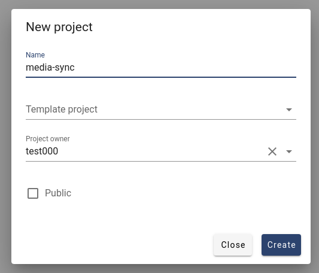
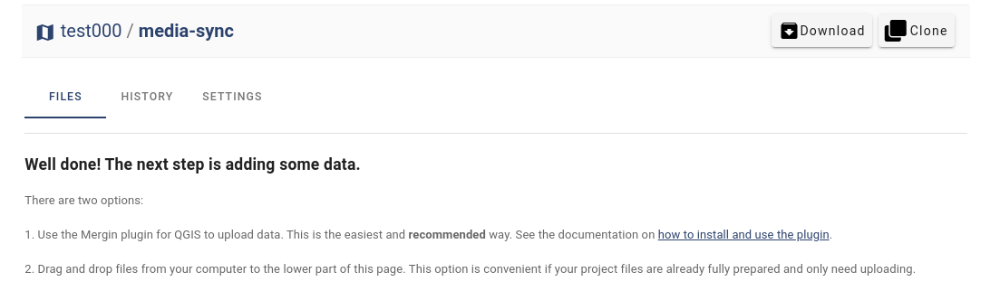
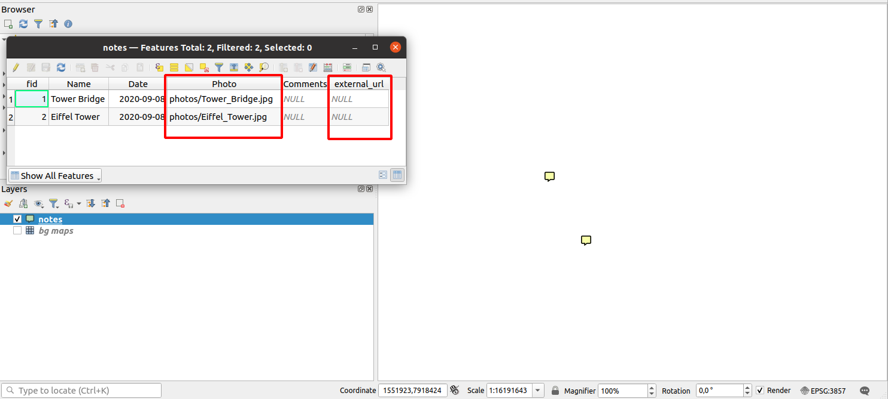
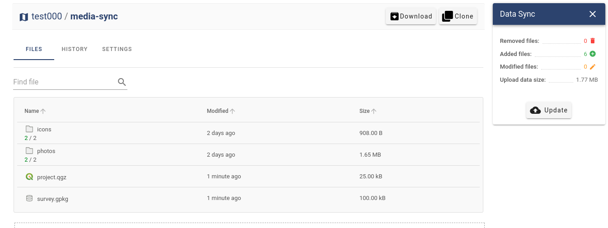
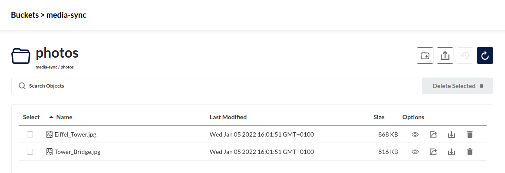
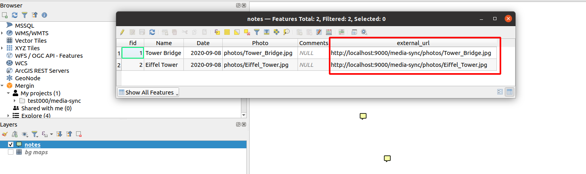

# Quick start guide

In this quick start guide you will set up one way synchronization between a new Mergin project and your existing bucket (MinIO or S3).

## Prerequisites

- MinIO/AWS S3 bucket
- docker engine

## 1. Create a bucket
Create a public bucket if you do not have one.

Alternatively you can run MinIO locally in docker by

```
docker run --name some-minio \
-v $(pwd)/minio_data:/data \
-p 9000:9000 -p 9001:9001 \
-d minio/minio server /data --console-address ":9001"
```

## 2. Create an empty mergin project
Go to [Mergin Maps](https://app.merginmaps.com/) website and create a new blank project.



You should see there are not any files there.



and your full project name for later will be `<username>/<project-name>`, e.g. `john/media-sync`

## 3. Set up QGIS project
Create a new QGIS project, add some layer (e.g. notes). Add few points and make sure you reference some pictures in attributes
(e.g. photo). Create additional column for new URL where files would be copied to (e.g. external_url). Your project may look like this:



Upload your project to Mergin Maps, either via web browser or [Mergin plugin](https://github.com/lutraconsulting/qgis-mergin-plugin).



You have now your project ready in Mergin Maps.

## 4. Create a config file
Copy `config.yaml.default` to `config.yaml` and edit it. The important parts for this quick start are:

```yaml
project_working_dir: /tmp/mediasync
allowed_extensions: [jpg, png]
operation_mode: copy
driver: minio

mergin:
  url: https://app.merginmaps.com
  username: test000
  password: myStrongPassword

minio:
  endpoint: minio-server-url
  access_key: access-key
  secret_key: secret-key
  bucket: destination-bucket
  secure: true

projects:
  - project_name: test000/media-sync
    bucket_subpath: media-sync
    references:
      - file: survey.gpkg
        table: notes
        local_path_column: photo
        driver_path_column: external_url
```

You can add more entries under `projects:` to sync multiple Mergin Maps projects with the same driver.

## 5. Start syncing
Run media-sync docker image with the config file from above:

```
docker run -it \
  --name mergin-media-sync \
  -v ${PWD}:/settings \
  lutraconsulting/mergin-media-sync /settings/config.yaml
```

and you should see photos copied from your Mergin Maps project to the bucket:



and your references in QGIS project updated:



In order to stop syncing simply stop docker container.
