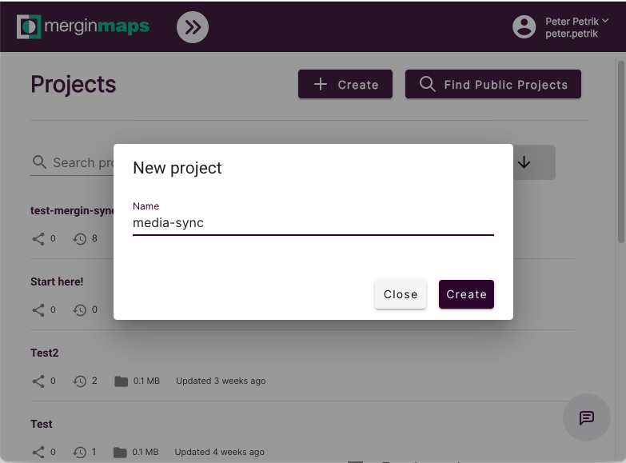
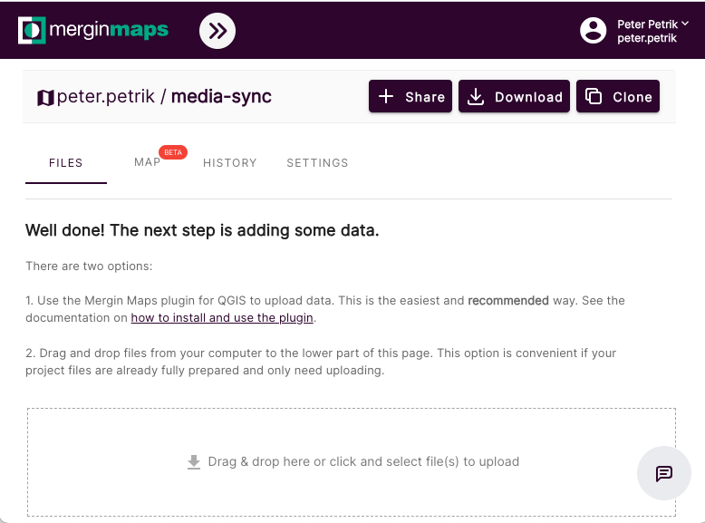
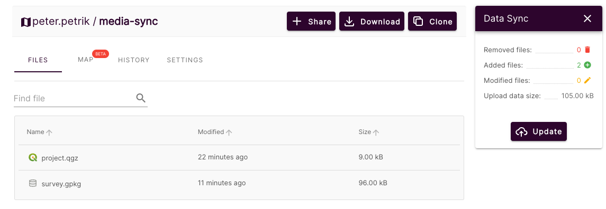

# Quick start guide

In this quick start guide you will set up one way synchronization between a new Mergin project and your existing bucket (MinIO or S3).

## Prerequisites

- MinIO/AWS S3 bucket
- docker engine

## 1. Create a bucket
Create a public bucket if you do not have one.

Alternatively you can run MinIO locally in docker by

```
docker run --name some-minio \
-v $(pwd)/minio_data:/data \
-p 9000:9000 -p 9001:9001 \
-d minio/minio server /data --console-address ":9001"
```

## 2. Create an empty mergin project
Go to [Mergin Maps](https://app.merginmaps.com/) website and create a new blank project.



You should see there are not any files there.



and your full project name for later will be `<username>/<project-name>`, e.g. `john/media-sync`

## 3. Set up QGIS project
Create a new QGIS project, add some layer (e.g. notes). Add few points and make sure you reference some pictures in attributes
(e.g. photo). Create additional column for new URL where files would be copied to (e.g. external_url). Your project may look like this:


Upload your project to Mergin Maps, either via web browser or [Mergin plugin](https://github.com/lutraconsulting/qgis-mergin-plugin).



You have now your project ready in Mergin Maps.

## 4. Start syncing
Download and run media-sync docker image with configuration based on above (you will need to tweak that):

Note that you may need to escape some characters in your password or username

```
$ sudo docker run -it \
  --name mergin-media-sync \
  -e MERGIN__USERNAME=test000 \
  -e MERGIN__PASSWORD=myStrongPassword \
  -e MERGIN__PROJECT_NAME=test000/media-sync \
  -e DRIVER=minio \
  -e MINIO__ENDPOINT="minio-server-url" \
  -e MINIO__ACCESS_KEY=access-key \
  -e MINIO__SECRET_KEY=secret-key \
  -e MINIO__BUCKET=destination-bucket \
  -e MINIO__SECRET=1 \
  -e OPERATION_MODE=copy \
  -e REFERENCES="[{file='survey.gpkg', table='notes', local_path_column='photo', driver_path_column='external_url'}]" \
  mergin-media-sync python3 media_sync_daemon.py
```
and you should see photos copied from your Mergin Maps project to the bucket:


and your references in QGIS project updated:


If you wish to specify folder within the bucket to store the files you can specify `MINIO__BUCKET_SUBPATH` variable
ie. `MINIO__BUCKET_SUBPATH=MyFolder` to store files in `MyFolder` instead of root of the bucket.

In order to stop syncing simply stop docker container.
